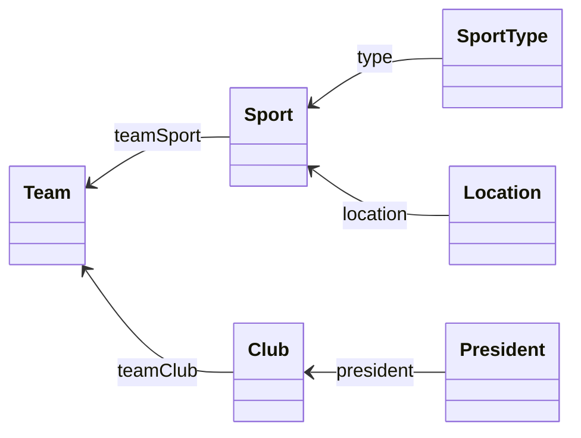
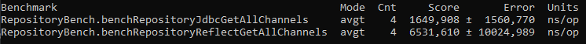

## Domain Model
Our domain model follows the image below:

## Slowdown of the RepositoryReflect implementation 

The following image shows the slowdown of the RepositoryReflect implementation compared to the ad-hoc ChannelRepositoryJdbc implementation.
With our implementation we achieved a 4x slowdown.

To achieve the slowdown shown above, we had to follow the principles enumerated below:
* Minimize the use of reflection in the operations that are called frequently. So we moved 
the majority of reflection to the constructor of the repository. Leaving only outside the constructor
when we need to return an object, or extract the primary key value to execute an update.
* We also store the auxiliary repositories in a map on the companion object, so we can reuse them when needed, instead
of always instantiating a new one when we need.